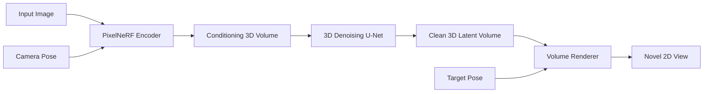

# Implementation Plan - True GeNVS (3D-Aware Diffusion)

This plan outlines the architecture for replacing the "Lite" GeNVS module with a true 3D-aware diffusion system, as defined in "Generative Novel View Synthesis with 3D-aware Diffusion Models".

## 1. Architecture Overview (Paper Adherence)

The system follows the **GeNVS (Chan et al., ICCV 2023)** architecture. It treats novel view synthesis as a 3D volume generation problem.

**Core Flow:**
1.  **Conditioning:** Input image is encoded into a 3D feature volume via **PixelNeRF-style Unprojection**.
2.  **Diffusion:** A **3D U-Net** denoises a 3D latent volume, conditioned on the feature volume.
3.  **Rendering:** The clean 3D volume is rendered to 2D using **Volumetric Ray Marching**.



## 2. Component Breakdown

### A. Encoder: Geometry Lifter (`scripts/genvs_core/encoder.py`)
- **Backbone**: `ResNet-34` (pretrained ImageNet) - as per Section 2.1.
- **Head**: `DeepLabV3+` with ASPP and **Learnable Upsampling** (ConvTranspose2d) instead of bilinear.
- **Normalization**: No Batch Norm or Dropout (Deterministic behavior).
- **Output**: 2D feature map with $C_{total} = 16 \times 64 = 1024$ channels.
- **Lifting**: Reshapes output to `[B, 16, 64, 128, 128]` (Batch, Feat, Depth, Height, Width).

### B. 3D Representation (`scripts/genvs_core/feature_volume.py`)
- **Type**: **Frustum-Aligned Voxel Grid** (NDC volume).
- **Dimensions**:
    - Channels ($C_{feat}$): 16
    - Depth ($D$): 64 planes
    - Spatial ($H, W$): 128 x 128
- **Total Size**: ~16.7M elements per image (requires careful memory management).

### C. Neural Renderer (`scripts/genvs_core/rendering.py`)
- **Ray Marching**: Stratified sampling (64 samples/ray).
- **Feature Query**: Trilinear interpolation within source frustum volumes.
- **Aggregation**: Mean pooling of features from multiple source views.
- **Decoding**: Lightweight MLP (`16 -> 64 -> 64 -> 17`) predicting Density (1) + Feature (16).
- **Output**: **16-channel Feature Image** (Neural Image), rendered at 64x64 and upsampled to 128x128.

### D. Diffusion Backbone (`scripts/genvs_core/unet_2d.py`)
- **Architecture**: **2D U-Net** (modified ADM/DDPM++).
- **Conditioning**: Channel-wise concatenation.
- **Input Channels**: 19 total (`3 Noisy RGB + 16 Feature Image`).
- **Base Channels**: 128.
- **Multipliers**: `[1, 2, 2, 2]` (128 -> 256 -> 256 -> 256).
- **Attention**: Only at low resolutions (16x16, 8x8) to save memory.

## 3. Implementation Steps

1.  **Setup Directory Structure** `scripts/genvs_core/`
2.  **Implement 3D Blocks** (`unet_3d.py`)
    *   ResNetBlock3D
    *   AttentionBlock3D
    *   Downsample3D/Upsample3D
3.  **Implement Renderer** (`rendering.py`)
    *   `get_rays()`
    *   `volumetric_rendering()`
4.  **Implement Pipeline** (`inference.py`)
    *   DDIM Sampler for 3D latents.
    *   Conditioning on Pose + Input Image.
5.  **Integration**
    *   Update `pipeline_wrapper.py` to use `GeNVSCore` when `quality_mode="quality"`.

## 4. Proposed File Structure

```
scripts/genvs_core/
├── __init__.py
├── config.py           # Hyperparameters
├── unet_3d.py          # 3D Denoising Network
├── rendering.py        # Ray marching & Projection
├── layers.py           # Helper 3D layers
└── pipeline.py         # Main runner (Load weights -> Sample -> Render)
```

## 5. Verification
- **Unit Test:** Pass a dummy 3D volume through U-Net -> Output shape check.
- **Unit Test:** Render a dummy volume -> 2D Image check.
- **System Test:** End-to-end generation from `automated_intelligent_pipeline.py`.
